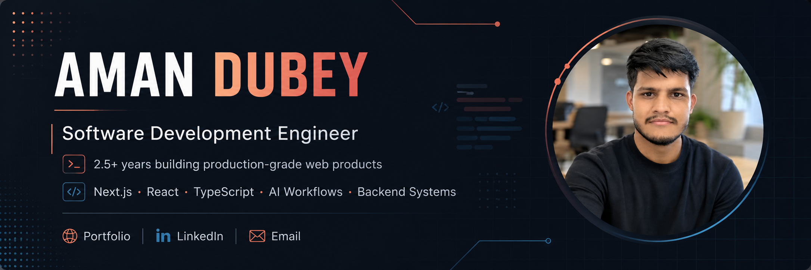

  

> [!NOTE]
> Most of my production contribution history is tied to company-managed/private repositories.  
> Active work GitHub: [@amandubey01](https://github.com/amandubey01)

---

## About
## About

I’m a **Software Development Engineer** with **2.5+ years of production experience** building web products with **Next.js, React, and TypeScript**.

Most of my work sits between **frontend architecture** and **product infrastructure** — AI workflows, search systems, payments, caching, data flows, SEO infrastructure, and performance-sensitive user interfaces.

Currently working on production systems at **Multibagg AI**, building tools for investor research and financial data workflows.

---

## Engineering Focus

- Building production-grade web products with **Next.js, React, and TypeScript**
- Designing frontend systems for data-heavy, user-facing products
- Working across AI workflows, streaming responses, search, and validation systems
- Building backend workflows with APIs, PostgreSQL, Prisma, Redis, and caching layers
- Shipping product infrastructure around payments, SEO, analytics, and performance

---

## Tech Stack

### Core

  
  
  
  

### Frontend

  
  
  
  

### Backend & Data

  
  
  
  
  

### Product Infrastructure

  
  
  
  
  

---

## Work Highlights

### Software Development Engineer · Multibagg AI

Worked across frontend architecture, AI workflows, financial research products, payments, search, SEO, caching, and backend data systems.

Key areas of ownership:

- **AI Research Systems** — streaming AI chat, session history, document workflows, intelligent routing, and research search flows.
- **Financial Product Interfaces** — stock, IPO, ETF, and index research experiences for investor-facing analytics.
- **Payments & Subscriptions** — Razorpay-powered subscriptions, webhooks, refunds, lifecycle handling, and reconciliation.
- **Search & Discovery** — dynamic pages, metadata, Open Graph, sitemap systems, autocomplete, and company discovery flows.
- **Performance & Data Infrastructure** — Redis caching, request deduplication, SWR data flows, scheduled jobs, and backend pipelines.

---

## Featured Project

### Forge

**AI fitness operating system**

Forge is a deployed Next.js fitness platform built around workout history, AI coaching, structured analytics, recommendation logic, and validated workout generation.

- **Stack:** Next.js, React, TypeScript
- **Focus:** AI coaching, workout intelligence, recommendation systems, validation pipelines
- **Live:** https://forge-omega-two.vercel.app/

---

## Connect

  
  
  

